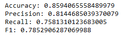
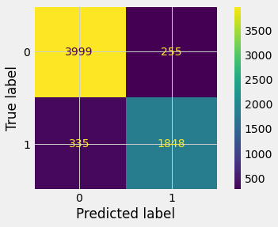
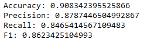

## Minimum Viable Product (MVP)

**Goal:** The goal of this project is to create a classification model that can predict whether or not an upset happens on the ATP tour. This model will help sports bettors more accurately place bets to beat their bookies and hopefully make some money. A model with high metrics may be able to be used to beat the odds setters, but even then, it will have to outcompete their models.

**Process:** This data set is from a Kaggle competition, but originates from http://tennis-data.co.uk. It contains around 45k matches from 2000-2018. The data was then cleaned, scaled, features were created, and dummy variables were created for analysis.

**Preliminary conclusions:** The first two models used were KNN (n=5) and Logistic Regression. These two models performed well, but definitely left room for improvement from tree models like Random Forest. Logistic Regression was the better performing model of the two, shown by its superior metrics below.

**From here:** This analysis can be improved upon by using tree models and possibly upsampling to help deal with class imbalance.

### KNN model:

### Logistic Regression Model:

