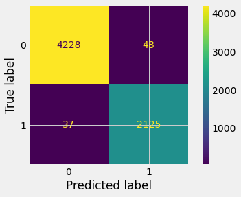

# ATP_project

### Abstract

The goal of this project was to create an optimized model to predict upsets (where a lower seeded player defeats a higher seeded player) in ATP tournaments. These predictions would be useful for a bettor who is attempting to find ways to beat the bookie's odds and find an upset that the bookie may not have been able to predict. I worked with data from this [kaggle competiton](https://www.kaggle.com/code/edouardthomas/beat-the-bookmakers-with-machine-learning-tennis/data) which uses data from this [data set](http://tennis-data.co.uk/notes.txt). I tested many different Machine Learning algorithms along with feature engineering and sampling techniques to create a robust model that is able to predict upsets very well.

### Design

This project comes from the above Kaggle competition, whose data I used to predict upsets. I engineered the dependent variable to be a binary 0 or 1 based on whether a higher seed won or lost. I then used this as the response variable for the testing of different machine learning algorithms. Being able to accurately predict these upsets would allow for a bettor to potentially beat a bookie if the predicted probabilities give better odds.

### Data

The dataset contains about 30,000 matches over 18 years, my model uses 10 Features from this dataset in its prediction. Some features are rank difference, court, surface, round, elo difference, etc. Most of these data points needed to be engineered into dummified variables or engineered from the provided raw data.

### Algorithms

**Feature Engineering**

- Converting some categorical features into binary dummy variables.
- Creating the "Upset" response variable
- Creating rank and elo difference variables, along with the logarithms

**Models**

Firstly I upsampled the training data in order to balance the data set, since it has about double the amount of non-upsets as upsets. Then I tested KNN, Logistic Regression, Random Forest Classifier, and Extra Trees before optimizing the Random Forest Classifier's hyper parameters with a Grid Search Cross Validation and finding extremely good results.

**Model Evaluation and Selection**

In evaluation of the models, I used the upsampled 80% training data, which ended up having around 32,000 data points to train my models and tested it on the holdout data. The Random Forest model then underwent a gridsearch to optimize the hyper parameters and was able to be optimized by its ROC AUC. I decided to choose this metric for the model because in a cursory Extra Trees model it was able to incorrectly predict everything as not an upset and get an extremely high precision, which is the metric that is most important for this project. The ROC AUC is the metric that shows how well a model distinguishes between the classes and does an extremely good job.

Final Test Metrics:

- Accuracy: 0.9867971419695558
- Precision: 0.9779107225034515
- Recall: 0.982886216466235
- F1: 0.9803921568627452

### Tools

- Pandas and Numpy for data handling and feature engineering
- Sklearn for modeling
- Matplotlib and sklearn for plotting

### Communications

Please find the presentation and code in the github.
